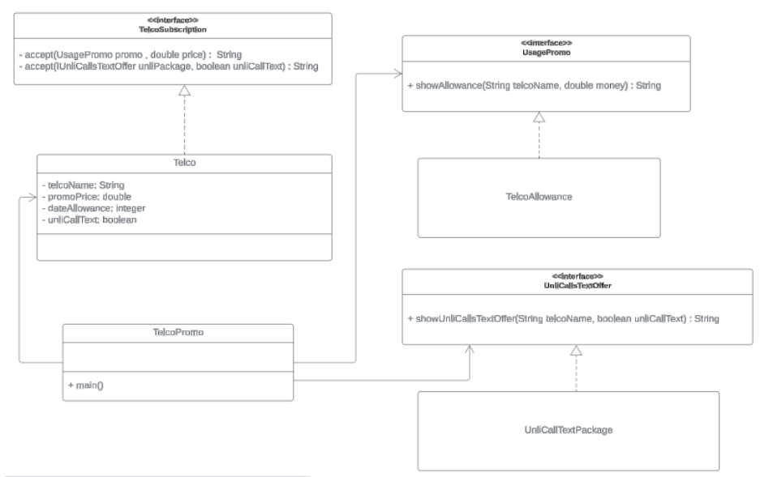

# Visitor Design Pattern Example

Imagine you are looking for a new mobile plan for your smartphone. Three major telecommunication providers are offering enticing deals: **Smart**, **Globe**, and **Ditto**.

## Available Plans

 **Smart:** Offers a data allowance of 15 GB for ₱500 per month. However, they do not offer any free calls or texts, and you will be charged per use.
 **Globe:** Provides a data allowance of 10 GB for ₱450 per month. This plan comes with unlimited calls and texts to subscribers within their network. Calls and texts to other networks are charged extra.
 **Ditto:** Offers a data allowance of 8 GB for ₱400 per month. This plan includes unlimited calls and texts to all networks within the country.

Implement the visitor design pattern based on the given diagram. Refer to this link.



Test your codes before the given client program:

```java
public class TelcoPromo {
  public static void main(String[] args) {
    // import VisitorPattern.unli.UnliCallOffer and UnliCallTextPackage at top of file
    TelcoSubscription smart = new Telco(15, 500, Smart,new UnliCallOffer(false));
    TelcoSubscription globe = new Telco(10, 450, Globe,new UnliCallOffer(true));
    TelcoSubscription ditto = new Telco(8, 400, Ditto,new UnliCallOffer(true));

    UsagePromo promo = new TelcoAllowance();
    UnliCallOffer unli = new UnliCallTextPackage();    

    System.out.println("Smart Data Usage Offer and price: " + promo.showAllowance(smart.getTelcoName(), smart.getPromoPrice()));
    System.out.println("Globe Data Usage Offer and price" + promo.showAllowance(globe.getTelcoName(), globe.getPromoPrice()));
    System.out.println("Ditto Data Usage Offer and price" + promo.showAllowance(ditto.getTelcoName(), ditto.getPromoPrice()));

    System.out.println("\nSmart unlimited calls and text package: " +

                                  unli.showUnliCallsTextOffer(smart.getTelcoName(), smart.getUnliOffer().hasUnlimited()));
    System.out.println("Globe unlimited calls and text package: " +

                                  unli.showUnliCallsTextOffer(globe.getTelcoName(), globe.getUnliOffer().hasUnlimited()));
    System.out.println("Ditto unlimited calls and text package: " +

                                   unli.showUnliCallsTextOffer(ditto.getTelcoName(), ditto.getUnliOffer().hasUnlimited()));
  }
}
```
